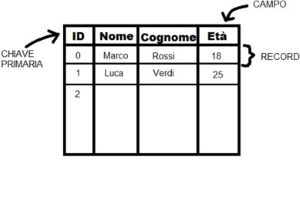
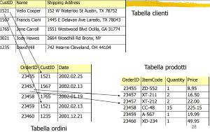
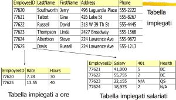
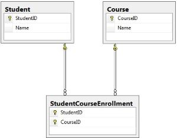

# campus-spring-jpa

### Database
Un database e' una collezione di dati ordinati sottoforma di tabelle.
Gli elementi che appartengono ad un database sono:
* `campo` o `field`, e' un contenitore di un determinato dato ( ad esempio in una tabella di uno studente sono campi il nome, il cognome, etc )
* `riga` o `record`, e' un insieme di campi, e compone un elemento composto da piu' dati ( nell'esempio precedente ogni studente, contente nome cognome etc, e' un record)
* `tabella`, e' un insieme di record e forma un gruppo di elementi contenenti uguali record e campi 
( sempre con lo stesso esempio, la tabella classe terza della scuola pippo, rappresenta l'insieme degli studenti che ne fanno parte).

Per distinguere ogni record della tabella, viene utilizzato un campo di identificazione univoco che prende il nome di `key` e, di solito, viene rappresentato da un numero. La key viene utilizzata come puntatore dell'elemento alla tabella.

###Implementazione di un database
La forma basica dei database e' quella `flat-file`, dove tutti gli elementi logici di un oggetto vengono inseriti in una singola tabella. Il rischio e' di creare ridondanze. 

Ad esempio in un contesto di un database di ordini di un prodotto, puo' verificarsi che un utente acquisti diversi prodotti in uno stesso ordine.
Quindi per ogni singolo ordine verranno ripetuti, tante volte quanti prodotti verranno messi nello stesso, i dati dell'utente. Ecco perche' non e' tanto utilizzato questo tipo di implementazione.

La forma più usata per implementare database e' quella dei `database relazionali`, creati per evitare ridondanze nella tabelle. Ogni entita' logica verra' rappresentata in differenti tabelle.
Nell'esempio degli ordini ci sara' una tabella per gli ordini e un'altra per i prodotti.
Si chiamano database relazionali perchè si creeranno delle `relazioni` tra le varie tabelle.

###Tipi di relazioni
Le relazioni possono essere di tre tipi:
* `relazioni uno a molti` ( one to many )
* `relazioni uno a uno` ( one to one )
* `relazioni molti a molti` ( many to many )

Ogni tabella avra' al suo interno una key per relazionarsi con altre tabelle le quali utilizzeranno la stessa key come referenza, `reference key`, per creare le relazioni. 

Nell'esempio precedente si crea una relazione one to many, perche' ogni singolo ordine puo' avere piu' prodotti. La tabella ordini avra' come key un id ordine. Mentre la tabella prodotti avra' come key, ad esempio un id che identifica il codice articolo. Quindi nella tabella prodotti ci sara' un campo con id ordine, che potra' ripetersi piu' volte quanti saranno i prodotti in quell'ordine.

La relazione one to one associa ogni singolo record di una tabella ad un solo record di un'altra tabella.
Ad esempio in un contesto di azienda con dipendenti ad ore e fissi, ci sara' una tabella principale di tutti i dati identificativi dei dipendenti. 
Poi ci saranno due tabelle una che identifica i lavoratori ad ore con le proprie caratteristiche ( ad esempio ore lavorate etc ) ed un'altra tabella che identifica i lavoratori fissi (stipendio, informazione sanitaria etc)
Quindi ogni lavoratore potra' essere o ad ore o salariato e dunque apparterra' o alla tabella ad ore oppure salariato.

La relazione many to many e' la piu' complessa e si verifica quando piu' records di una tabella ha relazioni con piu' records di un'altra tabella. (viene sempre creata una terza tabella chiamata `ausiliaria`)
Nell'esempio del mio campus, ogni studente potra' seguire piu' corsi, ma ogni corso allo stesso modo potra' essere seguito da piu' studenti. Quindi avremo una tabella con tutti gli studenti,
e un'altra con tutti i corsi, poi ci sara' una terza tabella dove verranno inserite le key della tabella studente e della tabella corsi, le quali potranno ripetersi.

JPA

JPA (Java Persistence API) è un framework che utilizza la tecnica dell'ORM (Object-Relational Mapping) per poter mettere in relazione 
oggetti Java con le tabelle di un database. 
Per mappare e quindi rendere persistenti degli oggetti, JPA utilizza delle annotazioni, che si identificano tramite la @. 
Per persistere un oggetto, JPA fa uso di @EntityManager, appartenenti al package javax.persistence, e permettono di poter creare, leggere, modificare, eliminare (CRUD), i dati del database. 
Ogni dato viene mappato in "entity" (@Entity), che rapparesenta la mappatura di ogni singola tabella del database.
Altre annotazioni per poter creare il database.
- @Id, specifica che il campo annotato è una primary key.
- @Column, specifica che questo campo mappa una colonna.
- @ManyToMany, definisce una relazione n-m.
- @OneToMany, definisce una relazion 1-m.
- @OneToOne, definisce una relazion 1-1.

Per poter utilizzare JPA, esistono diversi provider e tra i più usati c'è Hibernate, che rappresenta l'implementazione di JPA.