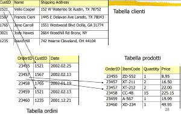
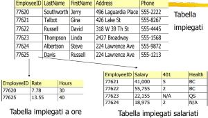
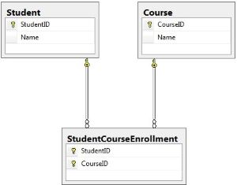

# campus-spring-jpa

#JPA
`JPA` (Java Persistence API) e' un framework che utilizza la tecnica dell'`ORM` (Object-Relational Mapping) per poter mettere in relazione oggetti Java con le tabelle di un database. 

###Mappatura e persistenza di un oggetto Java
Per `mappare` e quindi rendere `persistenti` degli oggetti, JPA utilizza delle annotazioni, che si identificano tramite la `@`. 
Tra i programmi in esecuzione e il database, si trova uno stato intermedio (`cache`), in cui i dati rimangono in "attesa" di essere persistiti prima di propagarsi nel database (`PersistenceContext`).
Per persistere un oggetto, JPA fa uso di `@EntityManager`, appartenenti al package `javax.persistence`, che sono delle entita' che permettono di poter creare, leggere, modificare, eliminare (`CRUD`) a runtime, i dati del database.
Ogni dato viene mappato in "entity" (`@Entity`), che rapparesenta la mappatura di ogni singola tabella del database.

###Lifecycle di una entity
1) Quando una nuova entity viene creata nella memoria Java, nulla cambia dal punto di vista degli oggetti persistenti. L'oggetto e' detto in stato `New` o `Transient`.

2) Invocando il metodo `persist()` dell'EnityManager l'oggetto e' reso persistente ed entra nello stato `Managed`.

3) Gli oggetti che sono stati resi persistenti entrano in uno stato denominato `Detached` nel quale le modifiche effettuate non verranno propagate al database. Questo stato puo' essere utile ad esempio nel caso in cui occorra effettuare diverse modifiche sull'oggetto, senza che queste debbano comportare l'aggiornamento della cache e del database.

E' possibile risincronizzare questi oggetti con il database, per far cio' occorre riportarli nello stato Managed tramite il metodo `merge()`.

4) Ultimo stato e' chiamato `Removed`, in cui gli oggetti vengono rimossi dal database ma restano a disposizione nella memoria Java.

###Principali annotazioni
Altre annotazioni per poter creare il database:
* `@Id`, specifica che il campo annotato e' una primary key.
* `@Column`, specifica che questo campo mappa una colonna.
* `@JoinColumn`, specifica un'associazione tra entity.
* `@ManyToMany`, definisce una relazione n-m.
* `@OneToMany`, definisce una relazion 1-m.
* `@OneToOne`, definisce una relazion 1-1.

###Tipi di relazioni
Le relazioni possono essere di tre tipi:
* `relazioni uno a molti` ( one to many )
* `relazioni uno a uno` ( one to one )
* `relazioni molti a molti` ( many to many )

Ogni tabella avra' al suo interno una key per relazionarsi con altre tabelle le quali utilizzeranno la stessa key come referenza, `reference key`, per creare le relazioni. 

Un esempio di relazione one to many puoì essere l'ordine di prodotti, perche' ogni singolo ordine puo' avere piu' prodotti. La tabella ordini avra' come key un id ordine. Mentre la tabella prodotti avra' come key, ad esempio un id che identifica il codice articolo. Quindi nella tabella prodotti ci sara' un campo con id ordine, che potra' ripetersi piu' volte quanti saranno i prodotti in quell'ordine.



La relazione one to one associa ogni singolo record di una tabella ad un solo record di un'altra tabella.
Ad esempio in un contesto di azienda con dipendenti ad ore e fissi, ci sara' una tabella principale di tutti i dati identificativi dei dipendenti. 
Poi ci saranno due tabelle una che identifica i lavoratori ad ore con le proprie caratteristiche ( ad esempio ore lavorate etc ) ed un'altra tabella che identifica i lavoratori fissi (stipendio, informazione sanitaria etc)
Quindi ogni lavoratore potra' essere o ad ore o salariato e dunque apparterra' o alla tabella ad ore oppure salariato.



La relazione many to many e' la piu' complessa e si verifica quando piu' records di una tabella ha relazioni con piu' records di un'altra tabella. (viene sempre creata una terza tabella chiamata `ausiliaria`)

Nell'esempio del mio campus, ogni studente potra' seguire piu' corsi, ma ogni corso allo stesso modo potra' essere seguito da piu' studenti. Quindi avremo una tabella con tutti gli studenti,
e un'altra con tutti i corsi, poi ci sara' una terza tabella dove verranno inserite le key della tabella studente e della tabella corsi, le quali potranno ripetersi.



Tra i vari provider che utilizzano JPA, sicuramente il piu' utilizzato e' `Hibernate`.

#Hibernate
Hibernate e' un framework open source che semplifica l’uso dei database relazionali nelle applicazioni Java presentando i dati relazionali come oggetti ordinari di Java.
Hibernate svolge le seguenti operazioni:
* Si occupa della mappatura e della configurazione necessarie per accedere al database;
* Nasconde i dettagli relativi al database relazionale sottostante e permette al programmatore
  di concentrarsi sulla logica di business (e non dello schema del database);
* Fornisce operazioni di ricerca e recupero dati;
* Genera la sintassi SQL necessaria per accedere al database;
* Formatta i risultati in oggetti Java, invece di un set di risultati SQL, che per un programmatore
  sono più  semplici da capire e utilizzare all’interno dell’applicazione;
* Effettua la mappatura tra gli oggetti Java e le entità relazionali del database.

###Configurazione di Hibernate in un progetto Maven
Per fare cio' occorre inserire, nelle `dependencies` del `pom`, le seguenti:

```
<properties>
	<h2.jdbc.version>1.4.200</h2.jdbc.version>
	<hibernate.version>5.4.30.Final</hibernate.version>
	<hibernate.persistence.version>1.0.2.Final</hibernate.persistence.version>
</properties>

<dependencies>
	<dependency>
		<groupId>org.hibernate</groupId>
		<artifactId>hibernate-core</artifactId>
		<version>${hibernate.version}</version>
	</dependency>
	<dependency>
		<groupId>org.hibernate.javax.persistence</groupId>
		<artifactId>hibernate-jpa-2.1-api</artifactId>
		<version>${hibernate.persistence.version}</version>
	</dependency>
	<dependency>
		<groupId>com.h2database</groupId>
		<artifactId>h2</artifactId>
		<version>${h2.jdbc.version}</version>
	</dependency>
</dependencies>		
```
Per snellire il lavoro, poiche' i vari database sono pesanti a livello di memoria, si utilizza spesso un database detto "on-the-fly" come `H2`.
Dopodiche' bisogna creare un file `persistence.xml`, dove all'interno verrano inseriti tutti i dati da persistere. Generalmente il file si inserisce nel percorso `src/main/resources/META-INF`.

```
<persistence xmlns="http://xmlns.jcp.org/xml/ns/persistence"
             xmlns:xsi="http://www.w3.org/2001/XMLSchema-instance"
             xsi:schemaLocation="http://xmlns.jcp.org/xml/ns/persistence 				http://xmlns.jcp.org/xml/ns/persistence/persistence_2_2.xsd"
             version="2.2">

	<persistence-unit name="campus-pu" transaction-type="RESOURCE_LOCAL">
		<provider>org.hibernate.jpa.HibernatePersistenceProvider</provider>

		<properties>
			<property name="javax.persistence.jdbc.url" value="jdbc:h2:mem:alm;MODE=Oracle;DB_CLOSE_DELAY=-1;INIT=runscript 			from 'classpath:ddl_create_db_h2.sql'" />
			<property name="javax.persistence.jdbc.user" value="" />
			<property name="javax.persistence.jdbc.password" value="" />
			<property name="javax.persistence.jdbc.driver" value="org.h2.Driver"/>
			<property name="hibernate.dialect" value="org.hibernate.dialect.H2Dialect" />

			<property name="hibernate.hbm2ddl.auto" value="create-drop" />
			<property name="hibernate.show_sql" value="true" />
		</properties>
	</persistence-unit>
</persistence>
```

#Spring
Un altro framework molto utilizzato dai programmatori Java e' `Spring`. Il cuore del framework e' costituito da un `Inversion of Control container` che si occupa di gestire l’intero ciclo di vita degli oggetti presenti nel contesto applicativo, dalla configurazione, al reperimento delle dipendenze e creazione delle singole istanze — il tutto, tramite `Dependency Injection`.

###Configurazione di Spring in un progetto Maven
La configurazione che utilizzero' e' quella tramite `@Annotation`.
Per fare cio' occorre inserire, nelle `dependencies` del `pom`, le seguenti:

```
<properties>
	<spring.version>4.0.0.RELEASE</spring.version>
</properties>	

<dependencies>
	<dependency>
		<groupId>org.springframework</groupId>
		<artifactId>spring-context</artifactId>
		<version>${spring.version}</version>
	</dependency>
	<dependency>
		<groupId>org.springframework</groupId>
		<artifactId>spring-orm</artifactId>
		<version>${spring.version}</version>
	</dependency>
	<dependency>
		<groupId>org.springframework</groupId>
		<artifactId>spring-test</artifactId>
		<version>${spring.version}</version>
		<type>jar</type>
		<scope>test</scope>
	</dependency>
</dependencies>
```
Fatto cio' si crea un file `context.xml` in cui si indica il contesto in cui deve agire spring per poter reperire e iniettare le dipendenze.

```
<?xml version="1.0" encoding="UTF-8"?>
<beans xmlns="http://www.springframework.org/schema/beans"
	 xmlns:xsi="http://www.w3.org/2001/XMLSchema-instance"
	 xmlns:context="http://www.springframework.org/schema/context"
	 xsi:schemaLocation="http://www.springframework.org/schema/beans
    http://www.springframework.org/schema/beans/spring-beans.xsd
    http://www.springframework.org/schema/context
    http://www.springframework.org/schema/context/spring-context.xsd">
				   
	<context:component-scan base-package="nome_package" />
</beans>
```
###Dependency Injection
La `Dependency Injection`, avviene tramite l'annotazione `@Autowired` e puo' essere di 3 modi:
* `Constructor Injection`, dove la dipendenza viene iniettata tramite l’argomento del costruttore

```
public class ExampleServiceImpl {
	private ExampleDao exampleDao;

	@Autowired
	public ExampleServiceImpl(ExampleDao exampleDao) {
		this.exampleDao = exampleDao;	
	}
}	
```
* `Setter Injection`, dove la dipendenza viene iniettata attraverso un metodo “set”

```
public class ExampleServiceImpl {
	private ExampleDao exampleDao;

	@Autowired
	public void setExampleServiceImpl(ExampleDao exampleDao) {
		this.exampleDao = exampleDao;	
	}
}	
```
* `Field Injection`, dove la dipendenza viene iniettata direttamente nella variabile.

```
public class ExampleServiceImpl {
	
	@Autowired
	private ExampleDao exampleDao;
}	
```
Sicuramente la piu' stabile e utilizzata dagli sviluppatori Java e' tramite costruttore.
L'annotazione `@Service`, viene utilizzata su una classe contrassegnandola come classe che esegue alcuni servizi, come eseguire la logica di business, eseguire calcoli e chiamare API esterne.
L'annotazione `@Repository` viene utilizzata sulle classi Java che accedono direttamente al database e funziona come marker per qualsiasi classe che svolge il ruolo di repository o `DAO (Data Access Object)`.

###JUnit Spring Test
Per poter fare i test con spring bisogna utilizzare l'annotazione `@RunWith` e utilizzare la classe di junit per spring, ed inoltre bisogna configurare il contesto tramite l'annotazione `@ContextConfiguration`

```
@RunWith(SpringJUnit4ClassRunner.class)
@ContextConfiguration(locations = "classpath:nome_file_context.xml")
```

#See
[H2 Database] https://www.h2database.com/html/grammar.html
